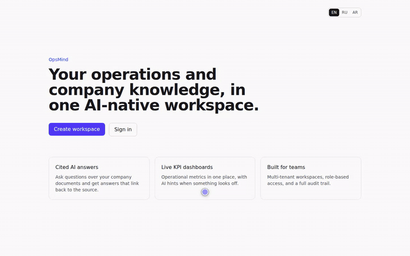
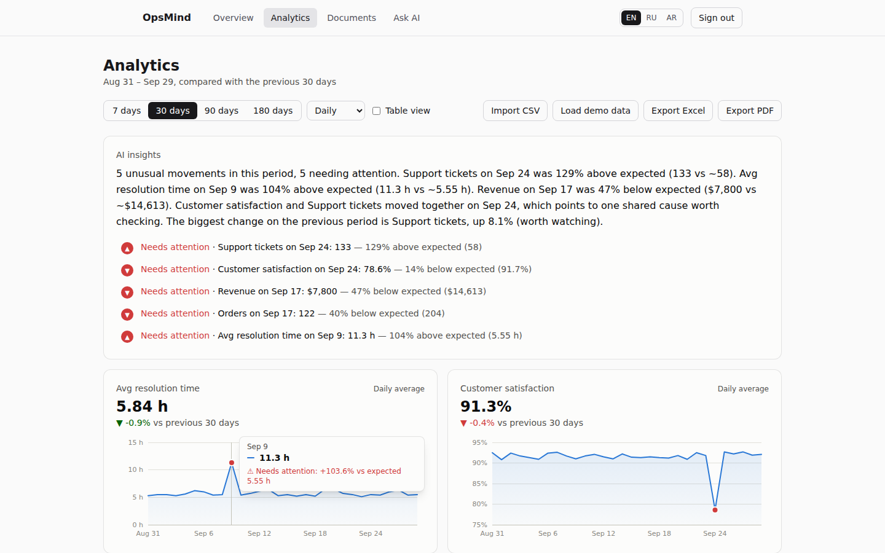
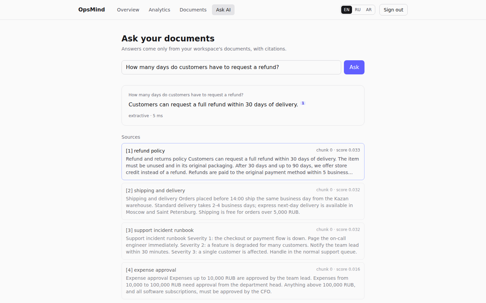
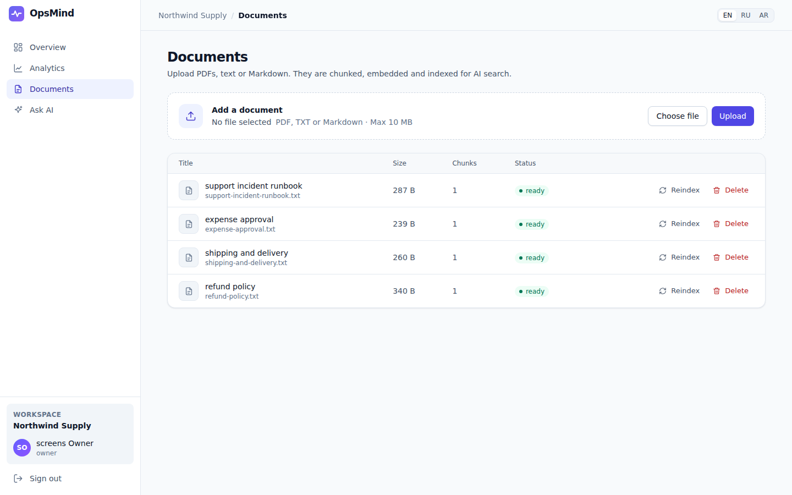
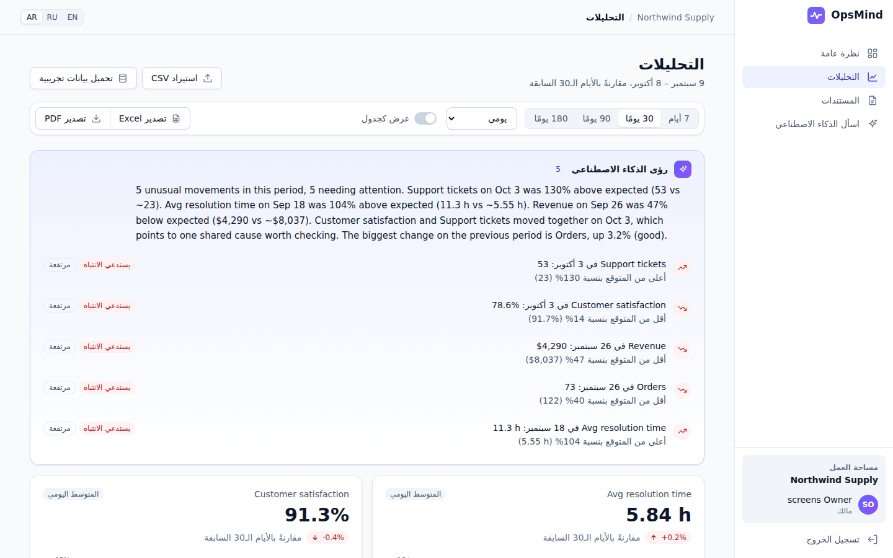
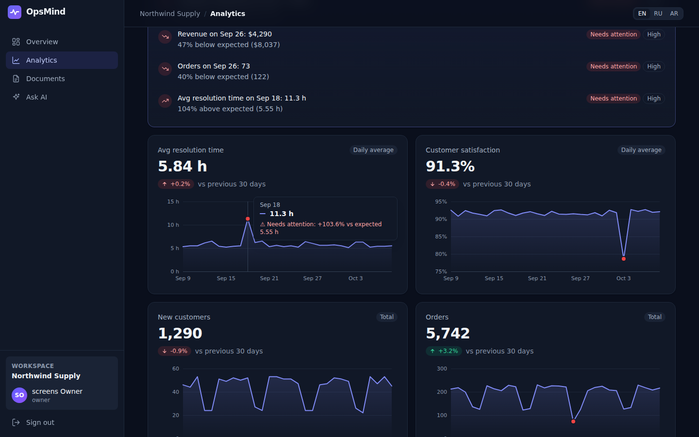

# OpsMind

[](https://github.com/kyan9400/opsmind/actions/workflows/ci.yml)
[](https://codespaces.new/kyan9400/opsmind?quickstart=1)

**A multi-tenant operations and knowledge platform for small businesses: cited AI answers from company documents, KPI dashboards that flag anomalies, and the CI/CD, Kubernetes and observability to run it.**

**Live demo:** **[opsmind-demo.vercel.app](https://opsmind-demo.vercel.app)**. Click **Try the live demo** to sign in as a read-only viewer. It is the real stack running serverless: Next.js, the Express API and the Python AI service on Vercel, and Postgres + pgvector on Supabase ([setup](deploy/vercel/README.md)). The daily [live check](.github/workflows/live-check.yml) tests it from outside. Some networks in Russia block `*.vercel.app`; the preview below opens there.

**Interactive preview:** [hass-ak.sourcecraft.site/opsmind](https://hass-ak.sourcecraft.site/opsmind/). It opens instantly with recorded demo data and no server, and it is clearly labelled as a preview ([how it works](deploy/sourcecraft/README.md#how-it-works)).

**Try the full system:** open the repo in [GitHub Codespaces](https://codespaces.new/kyan9400/opsmind?quickstart=1) and sign in with **Try the live demo** or `demo@opsmind.dev` / `opsmind-demo` (a read-only viewer). The first start builds the images and takes a few minutes, on your own free Codespaces quota ([details](.devcontainer/README.md)). Or [run it locally](#run-it-locally) with Docker.

A portfolio project by [Alhassan Alfarran](https://alhassan-portfolio-sigma.vercel.app/), Software & DevOps Engineer.



**Measured in CI:**

- **Tests:** 89 API tests (16 of them against a real Postgres), 79 AI-service tests (3 against pgvector), 14 Playwright browser tests and 8 unit tests of the answer renderer. The browser tests run twice, directly and through the Codespaces proxy; the two sandbox ones run only in the first pass, where sandboxes are on.
- **Pipeline:** 14 jobs on every pull request and every push to `main`, from unit tests to a Helm install on kind, a dev-container boot and the serverless profile the live demo runs ([list](#testing)).
- **Load:** k6 with 50 virtual users, 0 errors, p95 between 3.1 ms (documents) and 9.4 ms (ask) per endpoint in a typical run, against budgets of 100–800 ms. This uses the offline providers (hash embeddings, extractive answers), so `ask` measures retrieval, not an LLM ([details](#load-testing)).
- **Retrieval:** on 56 labelled questions over 12 documents in English, Russian and Arabic, hybrid search reaches Recall@5 85.7% and MRR@10 0.763 with the offline hash embedder ([details](#retrieval-quality)).

> All five milestones are done: multi-tenant foundation, RAG, KPI analytics, operations, and polish (three languages, browser tests, measured retrieval quality, demo workspace). See the [roadmap](#roadmap).



| Cited answers from your documents | Documents and indexing status |
|---|---|
|  |  |
| **Arabic, right-to-left** | **Dark mode** |
|  |  |

<sub>The screenshots and the demo GIF are produced by Playwright in the CI `browser` job (`SCREENSHOTS=1`, `DEMO_VIDEO=1` + `scripts/make-demo-gif.sh`) and uploaded as artifacts.</sub>

## Architecture

The same code runs in two shapes, chosen by environment variables.

**Docker Compose, Helm and Codespaces.** A BullMQ worker indexes uploads from a Redis queue. Redis also caches the AI insights, and the [observability overlay](#observability) adds Prometheus, Grafana and Jaeger.

```
          ┌──────────────┐        ┌───────────────────┐        ┌──────────────────┐
browser → │  Next.js web │ ─────► │  Node.js API (TS) │ ─────► │ PostgreSQL       │
          │  apps/web    │  REST  │  apps/api         │   SQL  │ + pgvector       │
          └──────────────┘        └────────┬──────────┘        └──────────────────┘
                                           │ enqueue                        ▲
                                           ▼                                │ chunks + vectors
                                  ┌───────────────────┐  /v1/ingest ┌──────┴────────────┐
                                  │ Worker (BullMQ)   │ ──────────► │ Python AI service │
                                  │ Redis queue       │             │ extract → chunk → │
                                  └───────────────────┘             │ embed → retrieve  │
                                   API ── /v1/ask, /v1/insights ──► │ → answer + cite   │
                                                                    └─────────┬─────────┘
                                                                              │ optional
                                                                              ▼
                                                                    ┌───────────────────┐
                                                                    │ LLM: OpenAI,      │
                                                                    │ Anthropic, Ollama │
                                                                    │ or any OpenAI-    │
                                                                    │ compatible host   │
                                                                    └───────────────────┘
```

**The live demo (serverless profile).** Three Vercel projects in Frankfurt and a Supabase database, with no worker and no Redis. With `INGEST_MODE=inline` the API indexes an upload itself right after it answers (Vercel's `waitUntil`), with the same retries as the worker. The browser only talks to the web address, which passes `/api/*` on to the API. Once a day, Vercel Cron calls the API to move the demo KPIs to today, re-index any document that is not ready and delete expired sandboxes ([details](deploy/vercel/README.md#how-the-live-demo-differs-from-docker-compose)).

```
          ┌───────────────┐  /api/* proxy  ┌───────────────┐  pooled SQL   ┌─────────────┐
browser → │ web (Next.js) │ ─────────────► │ api (Express) │ ────────────► │ Supabase    │
          └───────────────┘                └───────┬───────┘               │ Postgres    │
                                                   │ /v1/ingest (inline),  │ + pgvector  │
                                                   │ /v1/ask, /v1/insights └─────────────┘
                                                   ▼                              ▲
                                           ┌───────────────┐    pooled SQL        │
                                           │ ai (FastAPI)  │ ─────────────────────┘
                                           └───────────────┘
```

| Layer | Stack |
|---|---|
| Web | Next.js 15, React 19, TypeScript, Tailwind CSS 4 |
| API | Node.js 22, Express 5, Zod, JWT, bcrypt, pino-http, express-rate-limit |
| Data | PostgreSQL 16 + pgvector, Redis |
| AI | Python 3.12, FastAPI, pgvector, pypdf; OpenAI / Anthropic / Ollama / any OpenAI-compatible host |
| Queue & cache | Redis + BullMQ (retries with exponential backoff); versioned cache keys |
| Reports | ExcelJS (typed cells, number formats), PDFKit (vector sparklines, DejaVu for Cyrillic/Arabic) |
| Delivery | Docker, docker compose, GitHub Actions, Helm (tested on kind), Terraform, a Codespaces dev container, Vercel (serverless profile) |

## Design decisions

- **Tenant isolation by construction.** `tenant_id` is read only from the signed JWT, never from the request, and every query is scoped by it. An integration test proves one tenant cannot see another's users.
- **Role hierarchy `viewer < member < admin < owner`.** You can only grant or change roles strictly below your own, so an admin cannot mint another admin.
- **Live role checks.** The JWT only proves identity. The role is re-read from the users table on every request (one primary-key lookup), so a demotion or removal applies immediately instead of when the 8-hour token expires; a removed user's token gets 401.
- **An AI budget per visitor.** Questions, insights and report exports call the AI service, so they share one rate limit: 20 requests per minute per user and client IP, under an account-wide ceiling of 10× that across all IPs (`AI_RATE_LIMIT`, 0 disables). Every visitor on the shared demo login gets their own budget, and one account cannot pull unlimited LLM calls through many addresses. Login and registration allow 20 attempts per IP per 15 minutes (`AUTH_RATE_LIMIT`). Behind a proxy, both limits need `TRUST_PROXY` to see real client IPs; the production compose file sets it, and so does the Helm chart when its ingress is enabled. The counters live in memory, per API replica.
- **Login does not reveal which accounts exist.** An unknown email and a wrong password get the same error after exactly one bcrypt compare, so the timing matches too. Registration still answers 409 for a taken email; hiding that as well needs email verification.
- **Append-only audit log** with a `(tenant_id, created_at DESC)` index and keyset pagination, so the "recent activity" query stays O(limit) as the table grows.
- **Production-shaped from day one.** Multi-stage non-root images, health and readiness endpoints, graceful shutdown for rolling deploys, and migrations run on startup.

## How the RAG pipeline works

1. **Upload** (`POST /api/v1/documents`, member+): PDF / TXT / Markdown up to 10 MB is stored and a job is queued. The API answers `202 Accepted` right away.
2. **Worker** picks up the job and calls the AI service. Transient failures (AI service down, 5xx) get up to 3 attempts (2 retries, after 2 s and 4 s of exponential backoff); unreadable files fail fast (`UnrecoverableError`) and the error is shown on the document.
3. **Ingest**: extract text → normalise → split into ~800-char chunks with 100-char overlap on paragraph/sentence boundaries → embed in batches → replace the document's chunks **in one transaction**, so re-indexing never leaves a half-indexed document. A document over `INGEST_MAX_CHARS` characters of text (default 200,000), `INGEST_MAX_CHUNKS` chunks (300) or `INGEST_MAX_PDF_PAGES` pages (50) fails with `422 document too long` and is not retried: a compressed PDF can hold far more text than its file size, and every chunk costs a vector plus index entries in the database. A PDF over `INGEST_MAX_PDF_CONTENT_MB` of decoded page content (10), or one that takes longer than `INGEST_MAX_PDF_SECONDS` to read (20), fails with `422 document too complex`: drawing operators print no text, so the other limits do not see them, yet a few KB of them can take minutes to parse. `0` turns a limit off.
4. **Ask** (`POST /api/v1/ask`, viewer+): the question is embedded, then two candidate lists are retrieved **for the caller's tenant only**:
   - vector similarity (pgvector cosine, HNSW index)
   - full text: `to_tsquery('simple', …)` over an OR of the question's content words (EN/RU/AR stop words dropped), ranked by `ts_rank_cd`. The `simple` configuration has no language-specific stemming, so all three languages tokenize alike.

   They are merged with **Reciprocal Rank Fusion**. This catches exact terms (IDs, names) that embeddings miss, and paraphrases that keyword search misses.
5. **Answer**: the top chunks are numbered and sent to the LLM, which must cite `[n]`. The prompt treats sources as untrusted data (a prompt-injection guard). The response marks which sources were actually cited. If the LLM fails or hits a rate limit, the answer falls back to the extractive one (provider `extractive-fallback`) instead of an error.
6. **Display**: the web app renders a small Markdown subset (paragraphs, line breaks, lists, bold, italics, code) and turns `[n]` into chips that jump to the source card. It builds React elements, never HTML strings, so HTML or links in an answer stay plain text.

### Providers

| | Offline default | Hosted | Local |
|---|---|---|---|
| Embeddings (`EMBED_PROVIDER`) | `hash`: deterministic feature hashing, lexical only | `openai` (`text-embedding-3-small`, 768-d) | `ollama` (`nomic-embed-text`) |
| Answers (`LLM_PROVIDER`) | `extractive`: best-matching source sentences, cited | `openai`, `anthropic`, `openai-compatible` (any `/chat/completions` endpoint: Groq, OpenRouter, Cloudflare Workers AI, vLLM…) | `ollama` (`llama3.1`) |

The offline defaults need no API keys, so CI and a fresh `docker compose up` work out of the box. An LLM is optional and set per deployment. Switch to a real model for semantic quality:

```bash
# Fully local, private: nothing leaves the machine
docker compose --profile local-llm up -d
docker compose exec ollama ollama pull nomic-embed-text
docker compose exec ollama ollama pull llama3.1
# OLLAMA_URL overrides the localhost value in .env, which is only for running without Docker
OLLAMA_URL=http://ollama:11434 EMBED_PROVIDER=ollama LLM_PROVIDER=ollama docker compose up -d ai worker
```

> Changing `EMBED_PROVIDER` changes the vector space, so reindex existing documents afterwards (`POST /api/v1/documents/:id/reindex`).

`LLM_PROVIDER=openai-compatible` works with any `/chat/completions` host (Groq, OpenRouter, Cloudflare Workers AI, vLLM). It takes `LLM_BASE_URL`, `LLM_API_KEY` and `LLM_MODEL`, plus optional `LLM_TIMEOUT_S`, `LLM_MAX_TOKENS` and `LLM_EXTRA_BODY`. The same `LLM_*` settings work on every profile: on the Vercel ai project ([free-tier setup](deploy/vercel/README.md#optional-real-llm-answers-free-tier-for-example-groq)), in `.env` for Docker Compose, which passes them to the ai container, through the Terraform module on the VM, and in the Helm chart's `ai.extraEnv`. `LLM_EXTRA_BODY` adds host-specific JSON to each request, for example `{"chat_template_kwargs":{"enable_thinking":false}}` to turn off Gemma 4's thinking on Cloudflare. Thinking a model writes into its reply is removed, and a reply that is empty or cut off at `LLM_MAX_TOKENS` before citing a source falls back to the extractive answer.

`LLM_DAILY_MAX` (default 300) caps model calls per day for the whole deployment. The count is kept in Postgres (table `llm_usage`), so it holds across instances and a free daily quota lasts. Above it, answers fall back to the extractive one and summaries to the template until the next day, and the response names the fallback provider instead of failing.

In extractive mode a follow-up is answered from its own words ("and for damaged items?" → the damaged-items sentence); the previous question is added only when the follow-up's own words match nothing ("why is that?", "как долго?", "لماذا؟").

### Retrieval quality

Hybrid search is measured, not assumed. [`services/ai/eval`](services/ai/eval/README.md) contains 12 company policies (English, Russian, Arabic) and 56 labelled questions: exact codes and IDs, natural questions, paraphrases, and cross-language questions. Every CI run (`rag-eval` job) indexes them through the real `/v1/ingest` path and asks each question with vector-only, full-text-only and hybrid (RRF) retrieval. It reports Recall@1/3/5 and MRR by question kind and language, and fails if hybrid Recall@5 drops below 0.8.

The evaluation already paid for itself. It showed that `websearch_to_tsquery` ANDs every word, so the full-text leg matched almost no natural-language question. Full text now ORs the question's content words and lets `ts_rank_cd` rank the chunks.

| Mode | Recall@1 | Recall@3 | Recall@5 | MRR@10 |
|---|---:|---:|---:|---:|
| vector only | 53.6% | 75.0% | 87.5% | 0.668 |
| full text only | 66.1% | 75.0% | 80.4% | 0.710 |
| **hybrid (RRF)** | **69.6%** | **80.4%** | 85.7% | **0.763** |

Hybrid ranks the right document first most often. Every mode finds all 18 natural questions in the top 5. On paraphrases, hybrid finds 11 of 13, one more than either retriever alone. Vector-only's slightly higher Recall@5 comes from exact lookups: hybrid misses two that vector alone finds (an email address and a short Cyrillic code). The breakdown by kind and language is in the CI job summary and the `rag-eval-results` artifact.

> Measured with the offline `hash` embedder, which is lexical. Its known weak spot is cross-language questions (33% Recall@5): an English question about a Russian policy shares almost no words with it. A multilingual embedding model is the fix (`EMBED_PROVIDER=openai`, or `ollama` with a multilingual 768-d model in `OLLAMA_EMBED_MODEL`; the default `nomic-embed-text` is English-centric). It has not been measured on this dataset yet.

## KPI analytics

Businesses bring their numbers as a **CSV in long format** (`date,metric,value`), the shape every spreadsheet can export. Or an admin clicks **Load demo data** for 180 days of realistic metrics: growth trend, weekend dips, noise, and six injected incidents.

- **Import** (`POST /api/v1/metrics/import`, member+): comma, semicolon and tab files; `YYYY-MM-DD` or `DD.MM.YYYY` dates; `12 400,50`, `1.234,56` or `12,400.50` numbers.
  - The decimal separator is decided by position and by the file's delimiter, so a quoted `"12,400"` is never read as 12.4.
  - Bad rows, including values that split across columns and malformed quotes, are reported with their physical line number instead of failing the file.
  - Points are bulk-upserted with `unnest()` in 10k-row batches, one transaction per file; re-importing a day overwrites it.
  - A workspace can track up to 100 metrics, enforced under a row lock, since every view is O(metrics × days).
- **Dashboard** (`GET /api/v1/metrics/dashboard?days=30&bucket=week`): current vs previous period in a single SQL pass (`FILTER` clauses), and a series bucketed by day, week or month with `date_trunc`. Each metric knows whether it is a **total or an average** (revenue vs resolution time) and **which direction is good** (revenue up vs tickets up), which drives the delta colours and whether an anomaly is a problem. Buckets cut off by the period edge are flagged `partial` and drawn hollow.
- **AI insights** (`GET /api/v1/metrics/insights`): the Python service scores every day with a **seasonal robust z-score**:
  - *expected* = the median of the same weekday over the previous 8 weeks, so normal weekend dips are not "anomalies"
  - *noise* = the MAD of **leave-one-out** residuals across the whole 8-week window (~56 samples); in-sample residuals underestimate noise and cause false alarms
  - a day is scored only once its weekday has 4 weeks of history; a non-seasonal fallback would compare Sundays with Mondays
  - sparse counts (refunds that are 0 on most days) fall back from MAD to mean absolute deviation, so they don't flood the page with alerts
  - flagged when |z| ≥ 3.5 (Iglewicz & Hoaglin), "high" severity at 6

  Results are summarised in plain language, by the configured LLM or a deterministic template. They are cached in Redis under a per-tenant **data-version key** that every import or edit bumps, so invalidation is O(1) with no key scans.
- **Reports** (`GET /api/v1/metrics/export?format=xlsx|pdf`): an Excel workbook (summary with conditional delta colours, wide daily data with real date cells, anomalies sheet) or a PDF with KPI cards and sparklines. If the AI service is down, the report still generates without the insights section.

**Measured detector behaviour.** Every number below comes from [`services/ai/scripts/detector_benchmark.py`](services/ai/scripts/detector_benchmark.py): 500 seeded 120-day series with the last 30 days scored (15,000 day-checks), ±5% uniform noise, weekends at 50%. It is seeded, so `cd services/ai && python -m scripts.detector_benchmark` prints the same table on every run (about 17 s). Its demo data is a port of `apps/api/src/lib/demoData.ts`, and a test in `tests/test_anomaly.py` checks the demo claim.

| | Result |
|---|---|
| False alarms on incident-free data | 2 in 15,000 day-checks (0.013%) |
| 20% drop detected | 97% (14,541 / 15,000) |
| 25% drop detected | 99.9% (14,991 / 15,000) |
| 30% drop detected | 100% |
| Sparse 0/1 counts (P(1) = 25%) | 2.2 alerts per 30 days (9.5 without the mean-absolute-deviation fallback) |
| Demo data, 30 / 90 / 180-day views | The injected incidents are always found (5 / 6 / 6). The 30-day view never shows extra alerts. When the demo is loaded on a Tuesday or Friday, the 90-day view shows one extra medium alert and the 180-day view one or two; on a Monday only the 180-day view shows one. All are in the good direction. |

The charts follow a documented data-viz spec: one metric per chart (never two y-axes), 2px lines with a 10% area wash, hairline grid, a crosshair tooltip that snaps to dates and works with arrow keys, status-coloured anomaly markers (always paired with an icon and label, never colour alone), a table view for every chart, and a validated palette with separate light and dark steps.

## Operations

### Observability

Metrics, dashboards and distributed tracing run as an optional overlay on the normal stack:

```bash
docker compose -f docker-compose.yml -f docker-compose.observability.yml up --build
```

| Tool | URL | Notes |
|---|---|---|
| Grafana | http://localhost:3001 | Opens on the **OpsMind overview** dashboard (anonymous read-only) |
| Prometheus | http://localhost:9090 | Scrapes `api:4000`, `worker:9100`, `ai:8000` every 15s; alert rules under *Alerts* |
| Jaeger | http://localhost:16686 | Traces from `opsmind-api`, `opsmind-worker`, `opsmind-ai` |

- **Metrics**: RED histograms per *route template* (never raw URLs, so IDs can't explode cardinality), ingestion queue depth, job duration and outcomes, embedding and LLM latency per provider, anomalies by severity, and cache hit ratio. Runtime metrics come from every process.
- **Dashboard** (`ops/grafana/dashboards`), organised from symptoms to causes: at a glance, traffic and errors, latency p50/p95/p99, ingestion pipeline, AI service, runtime, insights cache.
- **Alerts** (`ops/prometheus/alerts.yml`), each with runbook notes: 5xx ratio, API p95 above 1s, ingest backlog, ingest failure rate, target down.
- **One trace per request, across services.** An upload's HTTP span starts the trace. The trace context travels *inside the queue job*, so the worker's `ingest document` span continues it. The call to the AI service carries `traceparent`, so its request span, embedding calls and every SQL insert appear in the same waterfall. Tracing costs nothing unless `OTEL_EXPORTER_OTLP_ENDPOINT` is set.

### Kubernetes

A hardened Helm chart (`deploy/helm/opsmind`) deploys the API, worker, AI service and web UI, with optional in-cluster Postgres (pgvector) and Redis.

- **Migrations** run in an API initContainer. They are serialized by a Postgres advisory lock, so replicas and rolling updates can start concurrently.
- **Secrets** are generated on first install and reused on upgrade, or you supply your own with `secrets.existingSecret`.
- **Hardening**: non-root, read-only root filesystem, all capabilities dropped, seccomp `RuntimeDefault`, and no service-account token. Optional NetworkPolicies (`networkPolicy.enabled`) allow only the paths the app uses (e.g. only api/worker may reach the AI service).
- **Scaling**: HPAs for api and ai, PDBs for every tier, zero-downtime rolling updates with a preStop drain.
- **Rate limits**: `TRUST_PROXY` is set to 1 automatically when the ingress is enabled, so the login and AI limits see real client IPs. `config.trustProxy`, `config.authRateLimit` and `config.aiRateLimit` override the defaults; limits are counted per API pod.
- **CI runs it for real.** The `kind` job builds the images, installs the chart into a throwaway Kubernetes cluster with NetworkPolicies on, and runs the **same end-to-end smoke test** as Docker Compose (upload → index → cited answer → KPI anomalies → reports), plus `helm test`.

The images are not published to a registry. Build and push them to one your cluster can pull from, then point the chart at it. The web image has the public URL baked in at build time; the API is served on the same host under `/api`.

```bash
REGISTRY=registry.example.com/you   # any registry your cluster can pull from
TAG=0.4.0                           # the chart's appVersion (the default tag)
docker build -t $REGISTRY/opsmind-api:$TAG apps/api
docker build -t $REGISTRY/opsmind-ai:$TAG services/ai
docker build -t $REGISTRY/opsmind-web:$TAG --build-arg NEXT_PUBLIC_API_URL=https://opsmind.example.com   --build-arg NEXT_PUBLIC_SITE_URL=https://opsmind.example.com apps/web
for c in api ai web; do docker push $REGISTRY/opsmind-$c:$TAG; done

helm upgrade --install opsmind deploy/helm/opsmind -n opsmind --create-namespace \
  --set image.registry=$REGISTRY --set image.tag=$TAG \
  --set ingress.enabled=true --set ingress.host=opsmind.example.com
```

### Load testing

[k6](https://k6.io) scripts live in [`load/`](load/README.md). Each run registers its own tenant, loads the demo KPIs, indexes a document, then ramps 0 → 20 → 50 → 0 virtual users over a read-heavy mix (50% dashboard, 20% insights, 15% ask, 10% documents, 5% me).

| Endpoint | p95 budget | p95 in a CI run |
|---|---:|---:|
| `GET /metrics/dashboard` | 300 ms | 5.4 ms |
| `GET /metrics/insights` (cached) | 200 ms | 7.3 ms |
| `POST /ask` | 800 ms | 9.4 ms |
| `GET /documents` | 200 ms | 3.1 ms |
| `GET /auth/me` | 100 ms | 3.3 ms |

That run had 0 errors. It used the offline providers (hash embeddings, extractive answers), so `ask` measures retrieval and the API, not an LLM. Shared CI runners are noisy: the `ask` p95 has ranged from about 8 to 70 ms across runs, still far inside its budget. The CI `load` job fails if any budget or the 1% error budget is exceeded, and publishes a p50/p95/p99 table in the run summary. It runs with `AI_RATE_LIMIT=0`, because every k6 request uses one token from one IP.

### Deployment

The live demo runs the **serverless profile** on Vercel and Supabase ([diagram](#architecture), [setup guide](deploy/vercel/README.md)). Vercel's Git integration redeploys its three projects on every push to `main`. The CI `serverless` job tests that profile on every pull request, and the daily [live check](.github/workflows/live-check.yml) tests the running demo from outside.

The **self-hosted path** below is ready but not running anywhere. CI validates it on every run (Terraform fmt/validate, the production compose file, the Caddyfile), and the deploy workflow skips itself until its secrets are set.

The target is one Ubuntu VM running the same images with Docker Compose. [Caddy](https://caddyserver.com) is the only public entrypoint, with automatic Let's Encrypt HTTPS, security headers (HSTS, CSP) and HTTP/3. Postgres, Redis, the AI service and `/metrics` are never exposed.

| Piece | Where |
|---|---|
| VM, firewall, static IP, first-boot setup (Yandex Cloud) | `infra/terraform/yandex` |
| Production overrides: Caddy, no host ports, restart policies, log rotation, memory limits | `docker-compose.prod.yml` |
| Continuous deployment after green CI on `main` (skipped with a notice until the `DEPLOY_*` secrets are set) | `.github/workflows/deploy.yml` |

```bash
cd infra/terraform/yandex
cp terraform.tfvars.example terraform.tfvars   # cloud/folder IDs, SSH key, your IP
export YC_TOKEN=$(yc iam create-token)
terraform init && terraform apply              # prints app_url, e.g. https://203-0-113-7.sslip.io
```

Terraform creates the secrets, and they are never stored in git. The deploy workflow only ships commits that passed CI, and waits for `/ready`. The compose part runs on any Ubuntu 22.04/24.04 VPS. Full guide: [infra/README.md](infra/README.md).

## Run it locally

```bash
cp .env.example .env
docker compose up --build
```

- Web: http://localhost:3000
- API: http://localhost:4000/health
- AI service: http://localhost:8000/health. Its interactive API docs (`/docs`, `/openapi.json`) are served only with `API_DOCS=true`. The `/v1/*` routes need the `x-internal-token` header (`AI_SERVICE_TOKEN`). Behind Caddy on the VM the service is not reachable from outside. On the serverless profile it is its own public Vercel function, so that token is what protects `/v1/*`, and the docs stay off.

The quickest way to a populated workspace is `bash .devcontainer/start.sh`: it starts the same stack, seeds the [demo workspace](#demo-workspace) and prints the login.

**Without Docker** you need Node.js 22, Python 3.12, PostgreSQL 16 with pgvector installed (the migrations run `CREATE EXTENSION vector`), and Redis 7. `.env.example` expects Postgres at `localhost:5432` (user `opsmind`, password `opsmind_dev_password`, database `opsmind`) and Redis at `localhost:6379`; edit `.env` if yours differ. Run each process in its own terminal, with `.env` loaded in every one:

```bash
cp .env.example .env
set -a; . ./.env; set +a          # export the variables into this shell (repeat in each terminal)
npm install
npm run migrate -w apps/api       # once, and after pulling new migrations
npm run dev:api                   # API on :4000
npm run dev:worker -w apps/api    # ingestion worker
npm run dev:web                   # web on :3000

python -m venv services/ai/.venv && . services/ai/.venv/bin/activate   # Windows: services/ai/.venv/Scripts/activate
pip install -r services/ai/requirements.txt
cd services/ai && uvicorn app.main:app --reload --port 8000             # AI service on :8000
```

## API (v1)

| Method | Path | Role | Description |
|---|---|---|---|
| POST | `/api/v1/auth/register` | public | Create a tenant and its owner |
| POST | `/api/v1/auth/login` | public | Get a JWT |
| POST | `/api/v1/sandbox` | public | Create a temporary sandbox workspace (only with `ALLOW_SANDBOX=true`) |
| GET | `/api/v1/auth/me` | any | Current user and tenant (`expiresAt` is set for a sandbox) |
| GET | `/api/v1/users` | viewer+ | List tenant users |
| POST | `/api/v1/users` | admin+ | Add a user (lower role only) |
| PATCH | `/api/v1/users/:id/role` | admin+ | Change role (audited) |
| GET | `/api/v1/audit?limit&before` | admin+ | Keyset-paginated audit trail |
| GET | `/api/v1/documents` | viewer+ | List documents and indexing status |
| POST | `/api/v1/documents` | member+ | Upload (multipart `file`); returns 202 |
| GET | `/api/v1/documents/:id` | viewer+ | Document status |
| POST | `/api/v1/documents/:id/reindex` | admin+ | Re-run ingestion |
| DELETE | `/api/v1/documents/:id` | admin+ | Delete document and its chunks |
| POST | `/api/v1/ask` | viewer+ | `{question, topK, history?}` → cited answer; `history` = up to 4 earlier `{question, answer}` turns (AI budget) |
| GET | `/api/v1/metrics` | viewer+ | Metric definitions |
| GET | `/api/v1/metrics/dashboard?days&bucket&to` | viewer+ | Period vs previous period + bucketed series |
| GET | `/api/v1/metrics/insights?days&to` | viewer+ | Anomalies + narrative summary (cached; AI budget) |
| GET | `/api/v1/metrics/export?format=xlsx\|pdf&days&bucket` | viewer+ | Download report (audited; AI budget) |
| POST | `/api/v1/metrics/import` | member+ | CSV upload (multipart `file`) with per-line errors |
| POST | `/api/v1/metrics/demo` | admin+ | Load 180 days of demo KPIs |
| PATCH | `/api/v1/metrics/:id` | admin+ | Name, unit, total/average, good direction |
| DELETE | `/api/v1/metrics/:id` | admin+ | Delete a metric and its data |

Every route except register, login and sandbox needs a bearer token, and the role is checked against the database on each request. Routes marked *AI budget* share the per-visitor AI rate limit and answer 429 when it runs out. Register and login share the per-IP credential limit. Emails on the reserved `.invalid` domain cannot be registered or added as users.

## Demo workspace

A read-only demo workspace ("Northwind Supply") has 180 days of KPIs with real incidents to find, and four company policies to ask questions about. The one-click way to see it is **Try the live demo** on [opsmind-demo.vercel.app](https://opsmind-demo.vercel.app). The **Open in GitHub Codespaces** badge at the top runs the full stack with the same workspace ([how it works](.devcontainer/README.md)). To seed it into a stack you are already running:

```bash
docker compose exec -e DEMO_EMAIL=demo@opsmind.dev -e DEMO_PASSWORD='choose-one' api node dist/seedDemo.js
```

- Visitors log in as **viewers**. They can explore dashboards, ask the AI and download reports, but cannot upload, import or change anything; CI checks this.
- Build the web image with `NEXT_PUBLIC_DEMO_EMAIL` / `NEXT_PUBLIC_DEMO_PASSWORD` to show a one-click **Try the live demo** button (the Codespaces overlay does this).
- The seed is safe to re-run. It reuses `DEMO_EMAIL` only if the workspace was created by the seed itself: the name matches `DEMO_TENANT_NAME` (default "Northwind Supply (demo)"), and its hidden owner and the viewer were created in the same transaction as the workspace. Otherwise it exits non-zero without changing anything, so it can never publish someone's real account.
- Each run resets the viewer's password and role, gives the hidden owner a new random password nobody knows, and removes every other account in the workspace (`removedUsers` in its output).

## Try it with your own data

The demo workspace is read-only and shared. **Try it with your own data** (landing and login pages) gives a visitor a private **sandbox workspace** instead: the same 180 days of KPIs and four sample documents, but the visitor is its owner, so they can upload their own files, import a CSV and ask about them. Access ends after 24 hours (every dashboard page says how long it has left), and the data is deleted soon after, at the latest about a day later.

- `POST /api/v1/sandbox` creates the workspace, an owner with an unguessable `@sandbox.invalid` address and a random password nobody knows, and returns `{ token, expiresAt }`. The token is the only way in.
- It answers right away; the sample documents are indexed in the background (the worker, or the API process with `INGEST_MODE=inline`), and the Documents page shows them becoming ready. Waiting would put a cold AI service and its retries inside the 300-second Vercel limit for nothing.
- Abuse limits: `SANDBOX_RATE_LIMIT` creations per IP per hour (default 3) and at most `SANDBOX_MAX_ACTIVE` live sandboxes (default 20, because the per-IP counter is per instance on serverless hosts). Each sandbox holds at most `SANDBOX_MAX_DOCUMENTS` documents (default 10, samples included), `SANDBOX_MAX_BYTES` of files (default 1 MB) with `SANDBOX_MAX_FILE_BYTES` per file (default 512 KB, documents and CSVs) and `SANDBOX_MAX_CSV_ROWS` KPI points over all imports (default 5,000, the 1,080 sample points included). These are checked in the write's transaction under a lock on the tenant row, so parallel requests cannot slip past them. Uploads, re-indexes, CSV imports and demo loads share `SANDBOX_WRITE_RATE_LIMIT` per sandbox per hour (default 20; counted in memory and again in the audit log, so it holds across serverless instances), and a sandbox can only re-index a failed or stuck document (409 otherwise). While the database is larger than `SANDBOX_DB_BRAKE_BYTES` (default 350 MB, checked once a minute per instance), sandbox creation and sandbox writes answer 503, so sandboxes stop growing long before a 500 MB free database fills up and turns read-only. The usual AI budget applies too. A sandbox cannot add users or change roles (403).
- Expiry: `tenants.expires_at` (migration `004`, empty for normal workspaces). From that moment its token gets 401 `sandbox expired`. The next sandbox creation deletes up to 10 expired sandboxes (oldest first), and the daily cron (`/api/internal/cron/seed`) deletes the rest, so the data is gone at the latest about a day after expiry; everything in a sandbox goes with the tenant (`ON DELETE CASCADE`).
- Off by default, and switched on per deployment: `ALLOW_SANDBOX=true` on the API and `NEXT_PUBLIC_SANDBOX=true` for the web build (Docker Compose passes `ALLOW_SANDBOX` to both). Without them the button is not shown. The static preview never shows it.

**Ask as a conversation.** The Ask page is a chat: follow-up questions are sent with the last 4 turns as `history` (2,000 characters per field), so "and for express?" is understood, and a rewritten search query is shown under the answer. The conversation stays for the browser tab (sessionStorage), and there are **New chat** and copy buttons. Answers appear word by word (instantly with reduced motion) and the page scrolls to the start of the new answer. Screen readers hear the whole answer once, through a polite live region, and never the half-typed text.

The UI is available in **English, Russian and Arabic**. Arabic uses a full right-to-left layout, and the language is rendered server-side, so the first paint is already correct.

## Testing

```bash
npm test -w apps/api                       # unit + HTTP tests
INTEGRATION=1 npm test -w apps/api         # + Postgres/Redis integration tests (DATABASE_URL of a migrated database)
pip install -r services/ai/requirements-dev.txt   # once, in the AI venv (see Without Docker): adds pytest and ruff
(cd services/ai && pytest -q)              # AI service (INTEGRATION=1 for pgvector tests)
bash scripts/smoke.sh                      # end-to-end against a running stack
npm ci && npx playwright install chromium  # once: browser for the e2e suite
AUTH_RATE_LIMIT=0 AI_RATE_LIMIT=0 docker compose up -d --build   # lift both rate limits for repeated test runs
npm test -w e2e                            # Playwright browser tests against http://localhost:3000
SCREENSHOTS=1 npm test -w e2e              # regenerate the README screenshots
```

CI runs every suite against real Postgres + Redis service containers. It then starts the whole stack with `docker compose` and runs the **end-to-end smoke test**:
- register → upload → the worker indexes it → ask → assert a cited answer
- load demo KPIs → dashboard → assert every injected incident is detected → download both reports and check their file signatures

**Browser tests** ([`e2e/`](e2e)) drive the real UI with Playwright against the full `docker compose` stack. Each spec creates its own workspace and selects elements by `data-testid`, so copy changes and translations don't break them:
- **auth**: register → dashboard → sign out → sign in; a wrong password shows an error
- **documents + ask**: upload a policy → wait for indexing → cited answer; a follow-up question is sent with the history, survives a reload, and **New chat** clears it
- **ask UI** (API stubbed in the browser, so each case controls the answer): LLM-style Markdown is formatted and raw HTML stays text, citation chips jump to their source, the answer is announced once and focus returns to the input, a phone scrolls to the new answer, the search query is isolated in the Arabic label, and the Russian sandbox banner and button fit a 360 px screen
- **sandbox** (with `ALLOW_SANDBOX=true`): create a sandbox → upload a text file → wait until it is ready → ask about it
- **analytics**: demo KPIs, anomalies, 90-day weekly view, table view, Excel download
- **rbac**: a viewer sees no upload, import or demo controls, and the API refuses them too
- **i18n**: Russian and Arabic (RTL) switch `<html lang/dir>` and survive a reload
- **answer Markdown** (unit tests, no browser): the parser, the word-by-word reveal and the text read to screen readers

CI runs fourteen jobs on every pull request and every push to `main`:

| Job | What it checks |
|---|---|
| `api` | Type check, migrations, unit + Postgres/Redis integration tests, build |
| `web` | Type check and production build |
| `ai` | Ruff, pytest including the pgvector integration tests |
| `e2e` | Full stack with `docker compose`: smoke test; the demo seed is idempotent and read-only |
| `browser` | Playwright suite; regenerates the screenshots and records the demo GIF |
| `rag-eval` | Retrieval evaluation; fails if hybrid Recall@5 drops below 0.8 |
| `load` | k6 load test against latency and error budgets |
| `kind` | Helm lint, manifest validation, install on kind, smoke test and `helm test` |
| `infra` | Terraform fmt/validate, production compose override and Caddyfile validation |
| `observability` | Prometheus config and alert rules, Grafana dashboards, compose overlay |
| `codespace` | `.devcontainer/start.sh` (twice, like a restarted codespace), then demo sign-in, smoke test, the one-click demo in a real browser and the Playwright suite, all through the web app's same-origin proxy |
| `devcontainer` | Boots the dev container end to end as Codespaces does, then checks the demo button is served |
| `serverless` | The Vercel profile without Redis or a worker: entry points load as on Vercel, inline indexing, the daily cron seed, sandbox create/limits/expiry/cleanup, closed sign-up and hidden `/metrics` |
| `preview` | Records the static SourceCraft preview from the real stack, builds it and smoke-tests it in a browser with no API |

## Roadmap

- [x] **Week 1 — Foundation:** monorepo, auth, multi-tenancy, RBAC, audit log, Docker, CI
- [x] **Week 2 — RAG:** document upload, ingestion queue, embeddings in pgvector, hybrid search (vector + full-text, RRF), cited answers, local LLM option
- [x] **Week 3 — Analytics:** KPI dashboard, CSV import, seasonal anomaly detection with AI summaries, Excel/PDF reports
- [x] **Week 4 — Ops:** Prometheus metrics, Grafana dashboards and alerts, OpenTelemetry tracing across services and the queue, Helm chart tested on kind, Terraform (Yandex Cloud) + Caddy HTTPS + CD, k6 load tests
- [x] **Week 5 — Polish:** EN/RU/AR with RTL, Playwright browser tests, retrieval evaluation (Recall@k / MRR in CI), read-only demo workspace, login and AI rate limits, live role checks, one-click Codespaces demo

## What I would do next

- **A multilingual embedding model** for cross-language questions, the weak spot of the offline hash embedder (33% Recall@5), measured on the same evaluation set.
- **Managed Postgres with backups and point-in-time recovery.** The single-VM setup keeps the database on the VM's disk with no scheduled backups.
- **Redis-backed rate limits** shared across API replicas; today each replica counts on its own.
- **Email verification on sign-up**, which also lets registration answer the same way whether or not an email is taken.
- **Images published to GHCR with signed releases**, so the Helm chart installs without a local build.
- **SLO-based alerting**: multi-window error-budget burn-rate alerts instead of today's fixed thresholds.

## Author

**Alhassan Alfarran** — Software & DevOps Engineer · [Portfolio](https://alhassan-portfolio-sigma.vercel.app/) · [GitHub](https://github.com/kyan9400)
